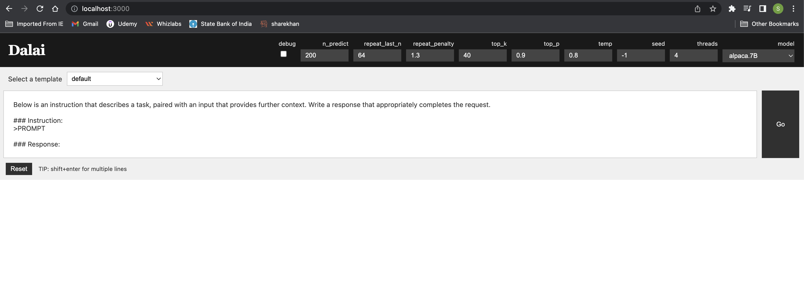
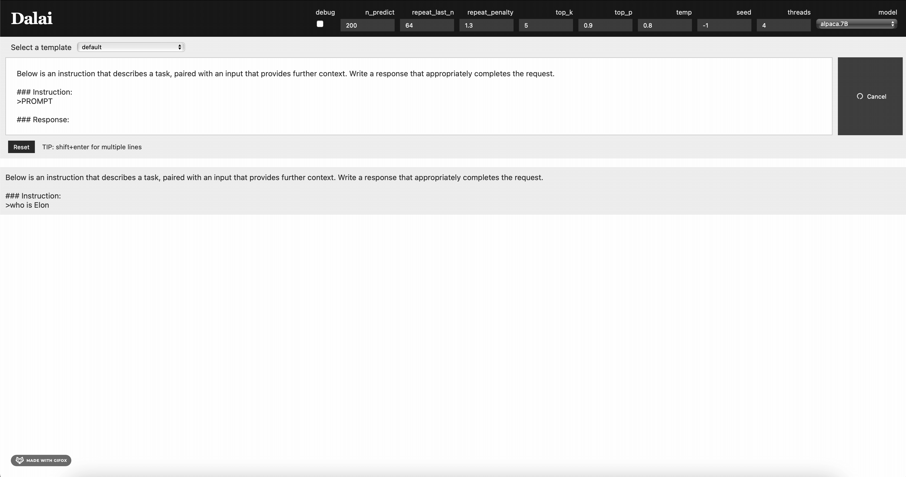

## Offline ChatGPT using Large Language Model (LLM)

Here we will see, how to run a ChatGPT-like LLM on a local machine without internet. This I have tested on macOS(13.1)

### Prerequisite
* Python 3.9.7
* [NodeJS](https://nodejs.org/en/download) version 18.0 or later
* [Pipenv](https://realpython.com/pipenv-guide/)

### Build with
* Python 3.9.7
* [Alpaca model](https://crfm.stanford.edu/2023/03/13/alpaca.html)


### What is Alpaca and LLaMA?
Alpaca is a small AI language model developed by a group of computer scientists at Stanford University. Alpaca is fine-tuned on LLaMa, Meta’s large language model which recently leaked online.

### Follow the below steps to install and start Offline ChatGPT

1. Here we are using **Alpaca 7B LLM model** (around **4.2 GB** disk space). 
If we want to install the **Alpaca 13B model**, then we need to replace 7B with 13B. **Note** the larger model needs **8.1 GB** of space.
We can use the below command to install alpaca model.
```
npx dalai alpaca install 7B
```

2. Run the below command to start the Web Server
```
npx dalai serve
```

3. Open the Web Browser at the below URL

```
http://localhost:3000

```






4. **Optional:** We can also install **LLaMa** models. LLaMA models are much larger. Its 7B model takes up to **31 GB** of space. 
We can also replace 7B with 13B, 30B, and 65B. The largest model takes up to **432 GB** of space. We can use the below command to install llama model.
```
npx dalai llama install 7B
```

### References
https://github.com/ggerganov/llama.cpp
https://github.com/tatsu-lab/stanford_alpaca


